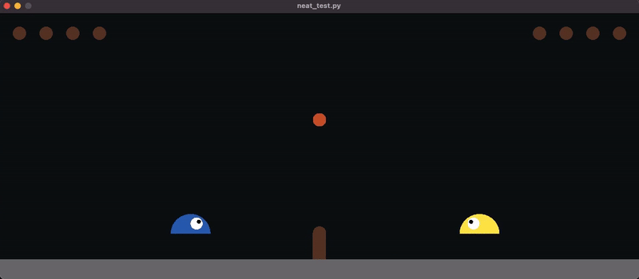
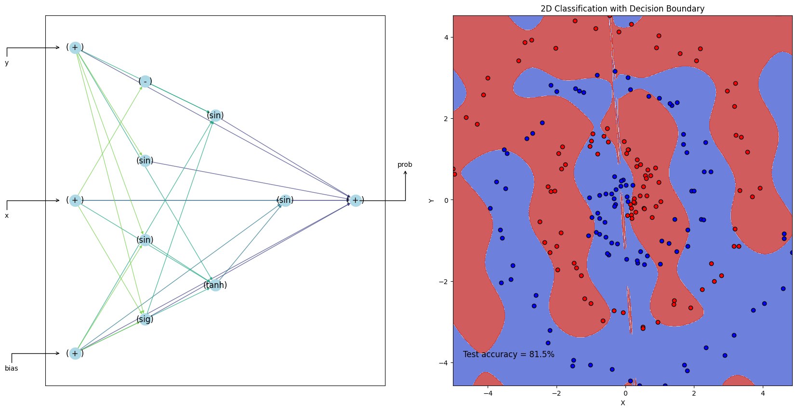

# BackpropNEAT_Gym
<table>
  <tr>
    <td></td>
    <td></td>
  </tr>
  <tr>
    <td></td>
    <td></td>
  </tr>
</table>

BackPropagation Neuroevolution of Augmenting Topologies (BackpropNEAT) algorithm in numpy and jax, built for multicore use and OpenAI's gym interface.

This repo is based on [PrettyNEAT](https://github.com/google/brain-tokyo-workshop/tree/master/WANNRelease/prettyNEAT) and [neat-python](https://github.com/CodeReclaimers/neat-python). Keeps the original functionalities of *PrettyNEAT* (fixed some bugs though) and added JAX backpropagation support to update weights of the neural network. For *neat-python*, it's keeped as a submodule with no modification. While inherited class and interface is used in the training scripts for JAX backpropagation support. Additional experiments are added as OpenAI's Gym interface for [slimevolley](https://github.com/hardmaru/slimevolleygym) and simple backprop two-class classification. 

Original NEAT paper by Ken Stanley and Risto Miikkulainen: [Evolving Neural Networks Through Augmenting Topologies](http://citeseerx.ist.psu.edu/viewdoc/download?doi=10.1.1.28.5457&rep=rep1&type=pdf)

Original WANN paper (based on prettyNEAT) by Adam Gaier and David Ha: [Weight Agnostic Neural Networks](https://arxiv.org/abs/1906.04358)

----------

Note: original [PrettyNEAT](https://github.com/google/brain-tokyo-workshop/tree/master/WANNRelease/prettyNEAT) assumes connection genes are not zero-weighted. It sets zero to no connection and np.nan to disabled connection when doing the evolution. While saving the final results, it sets no connection and disabled connections to zero. In this implementation, no connection and disabled connections are set to np.nan and saved as np.nan allowing zero-weighted connection genes (it makes sense for some activation function with non-zero output in zero point and more reasonable). Therefore, there might be conflicts when you directly use saved weights from original [PrettyNEAT](https://github.com/google/brain-tokyo-workshop/tree/master/WANNRelease/prettyNEAT). Transfer the zeros in original weights to np.nan and then it should work.

----------

## Dependencies

Core algorithm tested with:

- Python <= 3.11 (compatible with mpi4py)

- NumPy

- mpi4py

- OpenAI Gym 0.9.6 (`pip install gym` -- installation details [here](https://github.com/openai/gym))

- Slime Volley Gym 0.1.0 (`pip install slimevolleygym` -- installation details [here](https://github.com/hardmaru/slimevolleygym))

- pyglet <= 1.5.17

- opencv

Domains tested with:

- Neural Slime Volleyball

- BackpropGym

Tune weights of produced network topologies with CMA-ES:

- CMA-ES: cma 2.6.0 (`pip install cma`)

## Training

### Using prettyNEAT

Algorithm hyperparameters are stored in .json files in [p/](p/) directory. 
- default parameters for [p/default_neat.json](p/default_neat.json) using `-d`
- customized parameters .json files specified with `-p`
- num_workers with `-n`
- output_name_prefix `-o`

```shell
python neat_train.py -d p/default_neat.json -p p/customized.json -o default -n 8
```

The full list of hyperparameters is explained in [hypkey.txt](p/hypkey.txt)

Individuals are saved as 2D numpy arrays and after training can be retested and viewed with neat_view:

```shell
python neat_test.py -i log/test_best.out --view True
```

BackpropGym has no view implementation, refer to [prettyNeat_demo.ipynb](prettyNeat_demo.ipynb) for visualization.

see [prettyNeat_demo.ipynb](prettyNeat_demo.ipynb) notebook for example usage.

### Using neat-python

Config settings are in [config](config) and [config_backprop](config_backprop) for slimevolley and backprop classification respectively. Refer to [neat-python](https://github.com/CodeReclaimers/neat-python) for configuration details.

---------
TODO
- [ ] fix conflicts of JAX and Python multiprocessing for backprop neat-python.
---------

SlimeVolley:

```
python neat-python_slime.py
```

Backprop NEAT:

- num_workers `-n` 
- output_dir `-o` 

```
python neat-python_backprop.py
```
*Compatibility problems with python multiprocessing, use single worker now*

### neat-python Visualization

Refer to neat-python [examples](https://github.com/CodeReclaimers/neat-python/tree/master/examples)

-----------

On Windows, it is easiest to install mpi4py as follows:

- Download and install mpi_x64.Msi from the HPC Pack 2012 MS-MPI Redistributable Package
- Install a recent Visual Studio version with C++ compiler
- Open a command prompt
```
git clone https://github.com/mpi4py/mpi4py
cd mpi4py
python setup.py install
```
Modify the train.py script and replace mpirun with mpiexec and -np with -n


-----------
