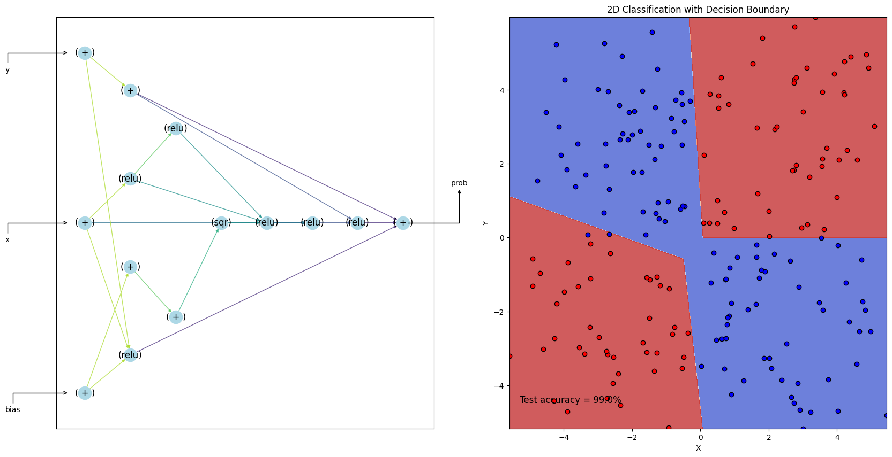
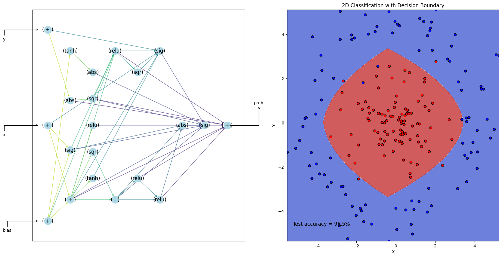
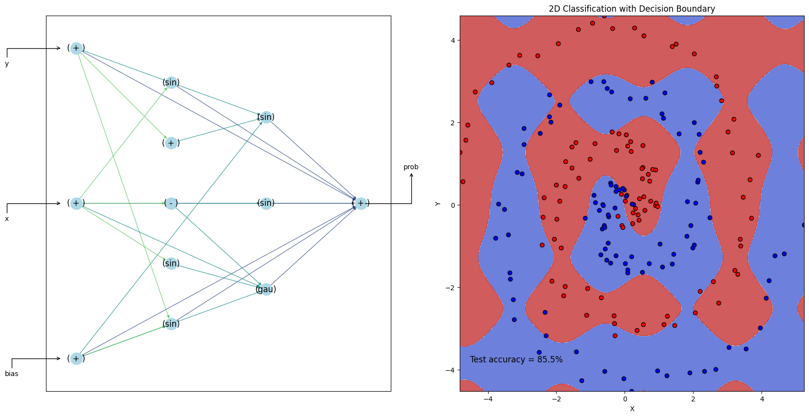

# BackpropNEAT_Gym
<table>
  <tr>
    <td></td>
    <td></td>
  </tr>
  <tr>
    <td></td>
    <td></td>
  </tr>
</table>

Back-Propagation Neuroevolution of Augmenting Topologies (BackpropNEAT) algorithm in numpy and jax, built for multicore use and OpenAI's gym interface.

This repo is based on [PrettyNEAT](https://github.com/google/brain-tokyo-workshop/tree/master/WANNRelease/prettyNEAT) and [neat-python](https://github.com/CodeReclaimers/neat-python). Keeps the original functionalities of *PrettyNEAT* (fixed some bugs though) and added JAX backpropagation support to update weights of the neural network. For neat-python, it's keeped as a submodule with no modification. While inherited class and interface is used in the training scripts for JAX backpropagation support. Additional experiments are added as OpenAI's Gym interface for [slimevolley](https://github.com/hardmaru/slimevolleygym) and simple backprop two-class classification. 

Original NEAT paper by Ken Stanley and Risto Miikkulainen: [Evolving Neural Networks Through Augmenting Topologies](http://citeseerx.ist.psu.edu/viewdoc/download?doi=10.1.1.28.5457&rep=rep1&type=pdf)

Original WANN paper (based on prettyNEAT) by Adam Gaier and David Ha: [Weight Agnostic Neural Networks](https://arxiv.org/abs/1906.04358)

## Dependencies

Core algorithm tested with:

- Python <= 3.11 (compatible with mpi4py)

- NumPy

- mpi4py

- OpenAI Gym 0.9.6 (`pip install gym` -- installation details [here](https://github.com/openai/gym))

- Slime Volley Gym 0.1.0 (`pip install slimevolleygym` -- installation details [here](https://github.com/hardmaru/slimevolleygym))

- pyglet <= 1.5.17

- opencv

Domains tested with:

- Neural Slime Volleyball

- BackpropGym

Tune weights of produced network topologies with CMA-ES:

- CMA-ES: cma 2.6.0 (`pip install cma`)

## Training

### Using prettyNEAT

Check out the `prettyNeat_demo.ipynb` notebook for example usage.

Algorithm hyperparameters are stored in a .json file. 
- default parameters specified with `-d`
- modification with a `-p`
- num_workers with `-n`
- output_exp_prefix `-o`

```
python neat_train.py -d p/neat_default.json -o default -n 8
```

The full list of hyperparameters is explained in [hypkey.txt](p/hypkey.txt)

Individuals are saved as 2D numpy arrays and after training can be retested and viewed with neat_view:

```
python neat_test.py -i log/test_best.out --view True
```

### PrettyNEAT Data Gathering and Visualization

see `prettyNeat_demo.ipynb` notebook for example usage.


### Using neat-python

config settings are in config and config_backprop for slimevolley and backprop classification respectively.

SlimeVolley:

```
python neat-python_slime.py
```

Backprop NEAT:

- num_workers `-n` 
- output_dir `-o` 

```
python neat-python_backprop.py
```
*Compatibility problems with python multiprocessing, use single worker now*

### Visualization

Refer to neat-python [examples](https://github.com/CodeReclaimers/neat-python/tree/master/examples)

-----------

On Windows, it is easiest to install mpi4py as follows:

- Download and install mpi_x64.Msi from the HPC Pack 2012 MS-MPI Redistributable Package
- Install a recent Visual Studio version with C++ compiler
- Open a command prompt
```
git clone https://github.com/mpi4py/mpi4py
cd mpi4py
python setup.py install
```
Modify the train.py script and replace mpirun with mpiexec and -np with -n


-----------
